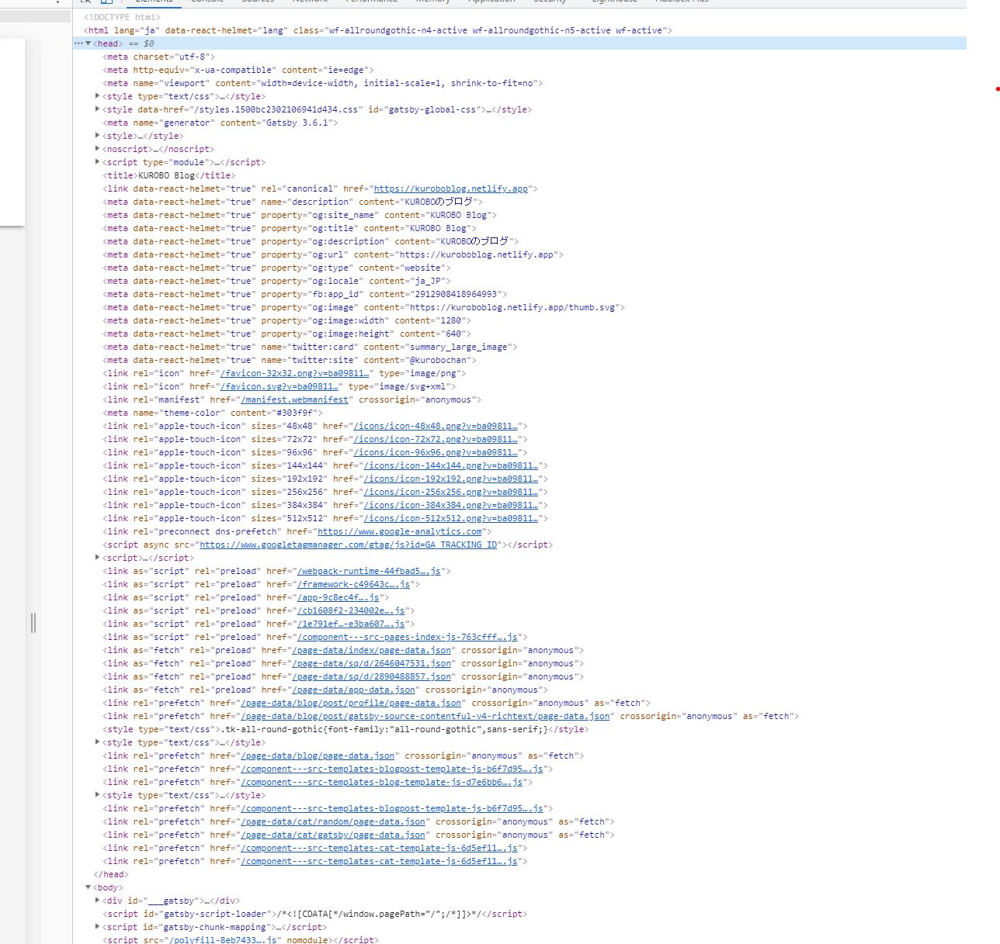
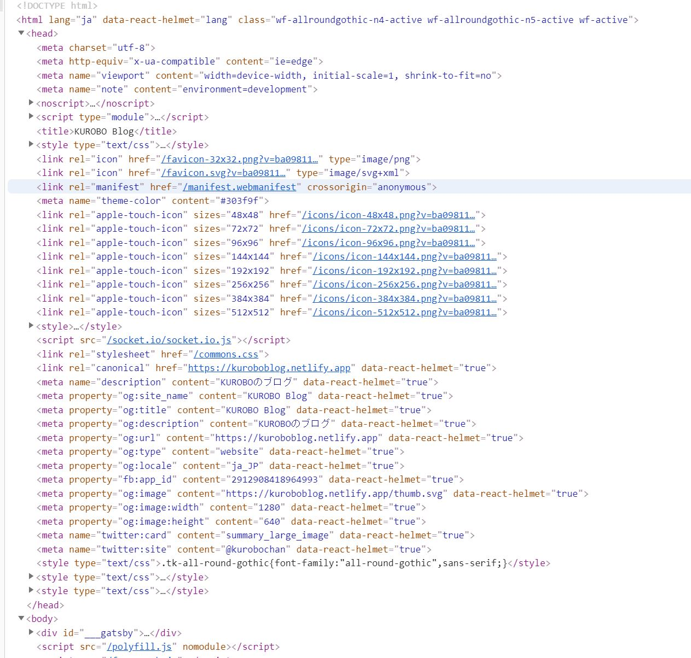
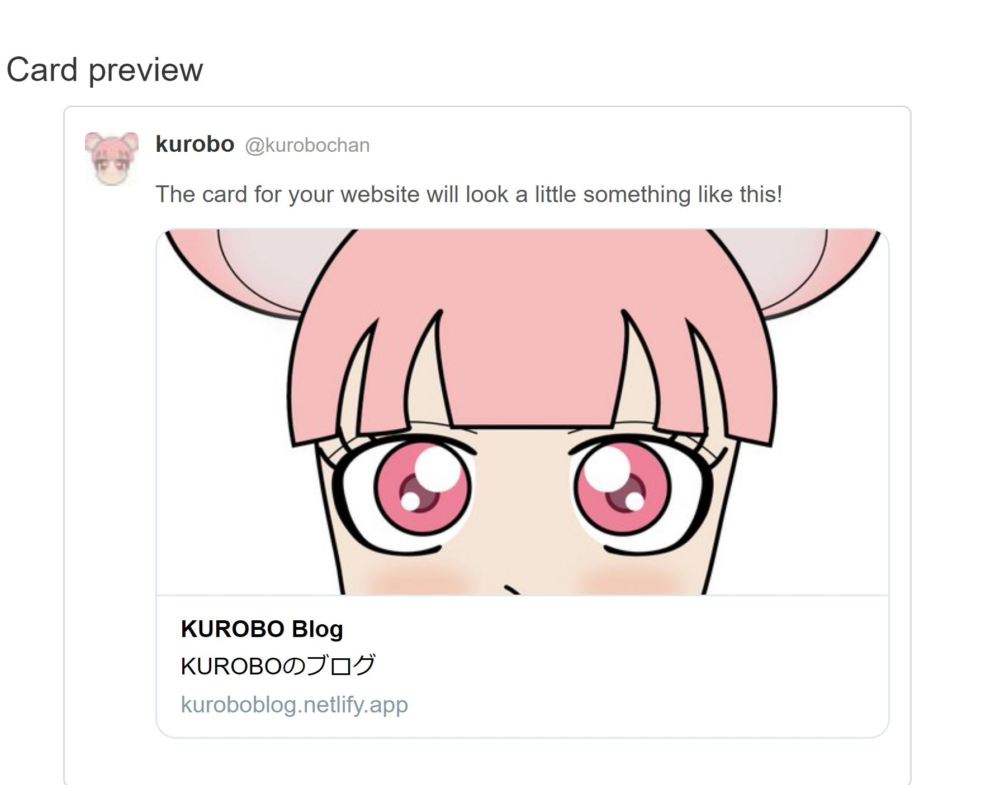
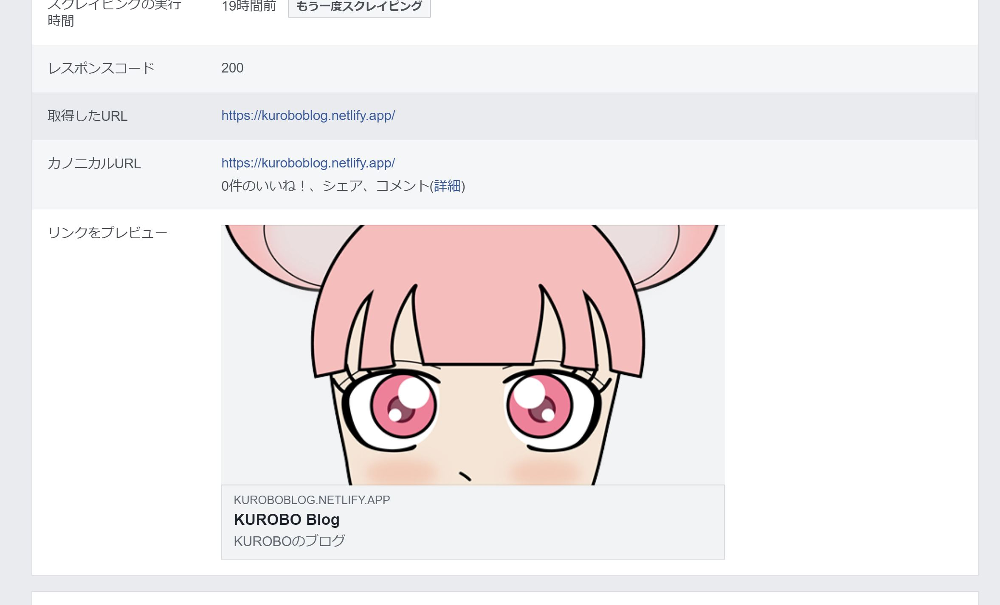

OGP 設定しているのになぜか Twitter カードと Facebook シェアが任意の表示にならないことの解決方法を記事にします。今回は[こちら](https://kakkiii-blog.dev/posts/510/)の記事を参考にして解決致しました。

## `head`タグ内の`meta`タグの記述の順番のせいらしい

[このサイト](https://github.com/gatsbyjs/gatsby/issues/9979)のコメントのやりとりを読んでると、`meta`タグの記述の順番によって表示されないようです。もっと英語が出来たら詳細がわかると思うのに・・・。

## `gatsby-ssr.js`の作成

プロジェクトフォルダのルートに gatsby-ssr.js というファイルを作成します。
`gatsby-ssr.js`とは、サーバー側レンダリング (`SSR`) されている静的 HTML ファイルのコンテンツを変更するためのファイル。・・・今回は head タグ内の内容を変更出来るファイルと解釈。<br/>
そして、そのファイルの中に先ほどのサイトから`style`タグの順番を変更するコードがあったので、これをそのまま記述します。

```js:title=gatsby-ssr.js
exports.onPreRenderHTML = function onPreRenderHTML({
  getHeadComponents,
  replaceHeadComponents,}) {
  const headComponents = getHeadComponents();
  headComponents.sort((a, b) => {
    if (a.type === b.type || (a.type !== 'style' && b.type !== 'style')) {
      return 0;
    }

    if (a.type === 'style') {
      return 1;
    } else if (b.type === 'style') {
      return -1;
    }

    return 0;
  });

  replaceHeadComponents(headComponents);
};
```

そして、開発サーバーを起動しなおします。`gatsby develop`





記述が入れ替わりました。そして、`gatsby build`してサイトを立ち上げます。

## それぞれのデベロッパーで確認





無事表示されました。
